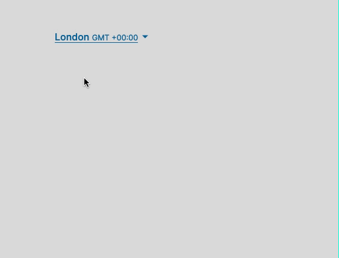

# Svelte Timezone Picker



You need a timezone picker that will allow the user to pick a timezone from a list. You want it to be accessible and follow the ARIA design pattern for a [select](https://www.w3.org/TR/wai-aria-practices/examples/listbox/listbox-collapsible.html).

This is a component that controls all user interactions and state for you. It follows best practices and accessibility guidelines.

> The timezones are all valid [IANA time zones](https://www.iana.org/time-zones).

## Installation

![Npm version][npm-version-badge] ![Build status][build-status-badge] ![Node Version][node-version-badge] ![License][license-badge]

This module is distributed via npm which is bundled with node and should be installed as one of your project's dependencies:

```
yarn add svelte-timezone-picker
```

```
npm i --save svelte-timezone-picker
```

> If you are going to use the svelte component, make sure you have svelte installed as well.

## Usage

### Svelte component

To use it in your Svelte app, simply import it as a component.

```html
<script>
  import TimezonePicker from 'svelte-timezone-picker';

  let timezone = 'Europe/London';

  function update(ev) {
    console.log(ev.detail.timezone);
  }
</script>

<TimezonePicker {timezone} on:update="{update}" />
```

### Web component

To use it as a web component, add the `index.js` file to your page and use it as a regular HTML element.

```html
<!-- use the new timezone-picker element -->
<timezone-picker timezone="Europe/London"></timezone-picker>

<!-- link it as module script -->
<script type="module" src="/path/to/web/index.js"></script>

<!-- listen for the update event on the picker -->
<script>
  window.addEventListener('load', () => {
    const picker = document.querySelector('timezone-picker');
    picker.$on('update', (event) => {
      const { timezone } = event.detail;
      // do stuff with the data
    });
  });
</script>
```

### Props

| Property           | Type    | Required? | Description                                                                      | Default                                            |
| :----------------- | :------ | :-------: | :------------------------------------------------------------------------------- | :------------------------------------------------- |
| `timezone`         | String  |           | The current timezone. Must be a valid timezone from IANA.                        | `Intl.DateTimeFormat().resolvedOptions().timeZone` |
| `expanded`         | Boolean |           | Whether the dropdown should be automatically expanded or not.                    | `false`                                            |
| `allowedTimezones` | Array   |           | Control which timezones display in the list. Must be a valid timezone from IANA. | `null`                                             |

### Events

| Name     | Description                                    | Return                                |
| :------- | :--------------------------------------------- | :------------------------------------ |
| `update` | Dispatched every time you change the timezone. | An object with the selected timezone. |

### Styling

You can use CSS variables to style the DOM elements of timezone-picker.

```css
:root {
  --color-white: #fff;
  --color-info-900: #076196;
  --color-gray-100: rgba(0, 0, 0, 0.2);
  --color-gray-400: #acacac;
  --color-gray-600: #757575;
  --color-gray-900: #292929;
}
```

Check out the [Demo](./demo) or play with this on [Codesandbox](https://codesandbox.io/s/svelte-timezone-picker-demo-4ix87).

## License

MIT License - fork, modify and use however you want.

[license-badge]: https://img.shields.io/npm/l/svelte-timezone-picker.svg?style=flat-square
[node-version-badge]: https://img.shields.io/node/v/svelte-timezone-picker?style=flat-square
[npm-version-badge]: https://img.shields.io/npm/v/svelte-timezone-picker?style=flat-square
[build-status-badge]: https://img.shields.io/circleci/build/github/tricinel/svelte-timezone-picker?label=circleci&style=flat-square
